# Hi there!

I am AmberFrost, call me Amber!  
Knows a little bit about things, but not specialized at any of them >.<  
I love finding problem, then create more of it :D

## Language and Tools

## Some projects
*(as in those that I kinda liked how it turned out)*
- [PW-GUI](https://github.com/AmberIsFrozen/PW-GUI) - A GUI Application for authoring Minecraft Modpack, based on [packwiz](https://github.com/packwiz/packwiz).  
- [SplashFox](https://github.com/AmberIsFrozen/SplashFox) - A Minecraft mod that adds a bouncy blobfox to your loading screen.  
- [Joban Client Mod](https://github.com/DistrictOfJoban/Joban-Client-Mod) - A Minecraft mod/addon for the [Minecraft Transit Railway](https://github.com/Minecraft-Transit-Railway/Minecraft-Transit-Railway) mod that adds various decoration blocks.
- [obDRPC](https://github.com/AmberIsFrozen/obDRPC) - Adds Discord Rich Presence support to the open source train simulator [OpenBVE](https://github.com/leezer3/OpenBVE).
- [Hong Kong Light Rail Passenger Information Display Simulator](https://github.com/HKTSS/nlrt-pids) - A recreation of the vertical next-train display installed in Hong Kong Light Rail Stops, on the web.

## Stats

<i>^ I don't know how this happens, I totally write Java all day long</i>
